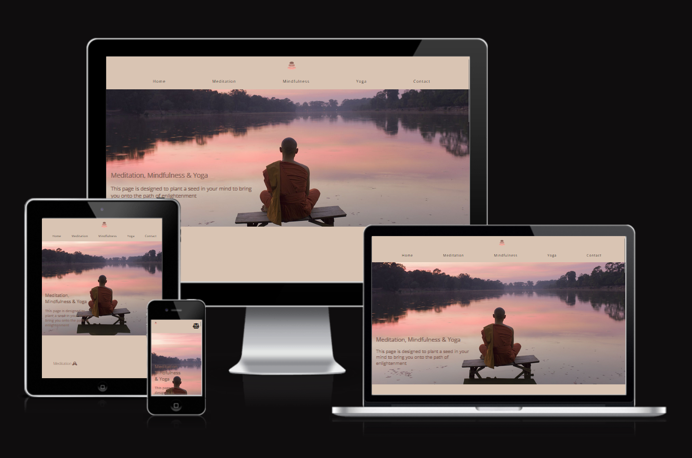
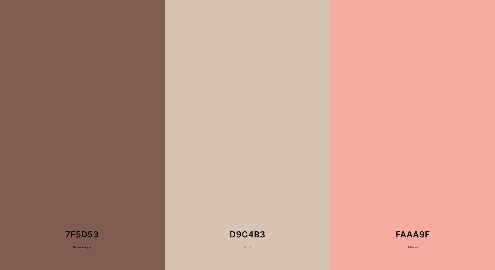

# [Timmys](https://conor-timmis.github.io/Timmys)

This is my Meditation, Mindfulness & Yoga website. My website is designed to plant a seed in peoples brains to take the saying "my body is a temple" to a whole new level, for people that are unknowing this will be a solid introduction. The aim of my page is to introduce these 3 ideas to the user in hopes of helping them better themselves mentally and physically. I am using information I have personally written to convey my message in both anecdotal and factual form. I call it Timmys.

With my Page, I'm trying to introduce all of my topics to the user. As someone who was heavily introverted and very ignorant I have became very open-minded, and much less introverted. I myself wouldn't be able to speak to new people easily before and now I can talk to anyone completely new, I don't find interacting nearly as tough, and going out nearly as stressful. I was also very opinionated and very "overly" caring of just about everything when I should've been letting the small things go. I want to bring this way of life to much more people around the world, bringing more people together and having less of the close-mindedness that I feel like we have today. I feel like my sites main use is to plant the seed in the users mind mostly, with what I have given, but this I feel is just a foundation and where people want to take it when they have read/learned of these subjects is up to them, and I have made it this way because I think having someone too hands on actually hinders the learning of the person. This way they will engage their brain much more, get them thinking and learning out of interest once they make their first steps.

## UX

My design process behind the page was to keep it short and simple, as I wanted to introduce plenty of description but not in terms of learning. I wanted to go over each topic individually with cold hard facts and lead up with anecdotal experiences of mine with them in correspodence. I originally wanted to write entire pages based on each topic but I felt this was actually too much for an "introduction" and it may lose the interest of the user, so instead I went with a one-page site that will help gauge interest by quickly being able to access each subject. I did this because reading an entire page with the potential of the user backing out if they were not interested would mean they would leave entirely, and wanted to assure that their time was not heavily used and would give them a brief overview of each instead.

### Colour Scheme

My colour scheme is a bit of mix and match towards the hero image, I have chosen these colours in particular because they give off a more natural feel when it comes to the aesthetics of the page. I feel anyone looking at the colour scheme would appreciate the same approach I have taken when it comes to these particular subjects, generally, the aim was always to keep it earthy and peaceful. It so happened that I found a perfect fit for the hero image.

- `#7F5D53` used for primary text.
- `#D9C4B3` used for primary background colour.
- `#FAAA9F` used for logo & hero image reference, mainly used in the mindfulness section.

### Typography

I have used the font "Open Sans" throughout and consistently in my project, and no other fonts have been used other than Sans-Serif to fallback on. I have chosen this font because I believe it fits very cleanly in the website and I find it to be one of the easier fonts to read all round, it isn't too sharp or blocky like most fonts I browsed. It also seemed to fit in every situation (e.g headers and paragraphs) cleanly with no issues looks very good. I have also decided to use Font Awesome because they provide a lot of useful icons I could use with my Headers to bring more attention to the page, just by using a simple script in my code and making use of their copy/paste icons it seemed to fit perfectly well in my website. I had originally thought of using different fonts (eg. Calibri, Roboto to name a couple) but overall it came down to just using Open Sans and the use of Font Awesome that totally had me in the end.

- [Open Sans](https://fonts.google.com/specimen/Open+Sans) is my choice of font for the primary headers and titles.

- [Font Awesome](https://fontawesome.com) icons were used throughout the site, as the burger menu icon, footer social media icons & headers throughout the sections.

## Wireframes

To follow best practice, wireframes were developed for mobile, tablet, and desktop sizes. I've used [Balsamiq](https://balsamiq.com/wireframes) to design my site wireframes, though they may differ from the end result of the pages, as I have had to change things here and there to improve user experience.

### Mobile Wireframes

  - [Index](documentation/wireframes/mobileindex.png)

  - [Contact](documentation/wireframes/mobilecontact.png)
    

### Tablet Wireframes

  - [Index](documentation/wireframes/tabletindex.png)

  - [Contact](documentation/wireframes/tabletcontact.png)

### Desktop Wireframes

  - [Index](documentation/wireframes/desktopindex.png)

  - [Contact](documentation/wireframes/desktopcontact.png)

## Features

- Navigation bar at the top of screen, with the website logo that brings you to the homepage.

- Mobile friendly navigation bar with burger drop-down menu

- Responsive on mobile and desktop devices

- Interactive buttons

- Content of personal experiences and advice for Meditation, Mindfulness and Yoga

- Informative videos for the corresponding subjects

- Social links in footer

- Contact us page

### Existing Features

- **Navigation Bar**

    - I have created a fully working navigation bar, which smooth-scrolls between the sections on the main page, as well as navigate between the Index & Contact pages
 

- **Footer**

    - The footer makes the end of the page a lot more cleaner and holds the social media icons with corresponding links to each of my own

 
  - **Contact Form**

    - I have created a contact form for the user to be able to get in contact with me with their questions or even issues which helps with user experience once they've taken in the information beforehand
