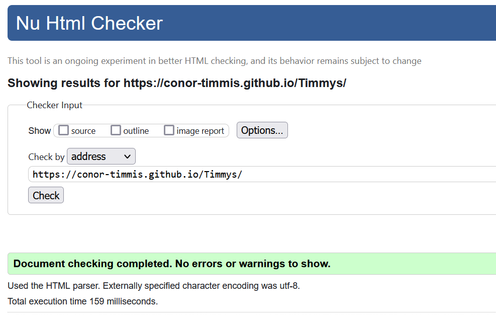
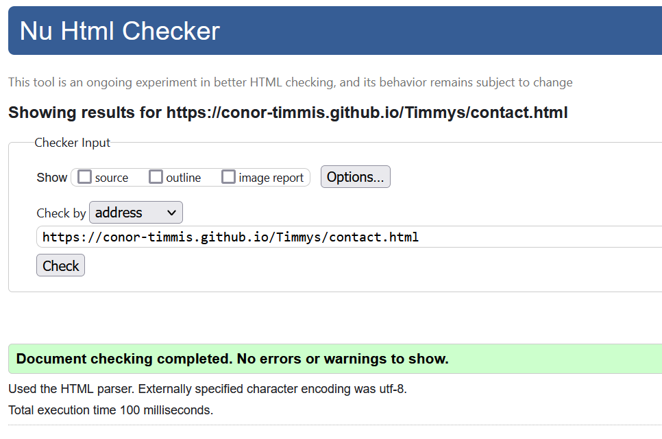
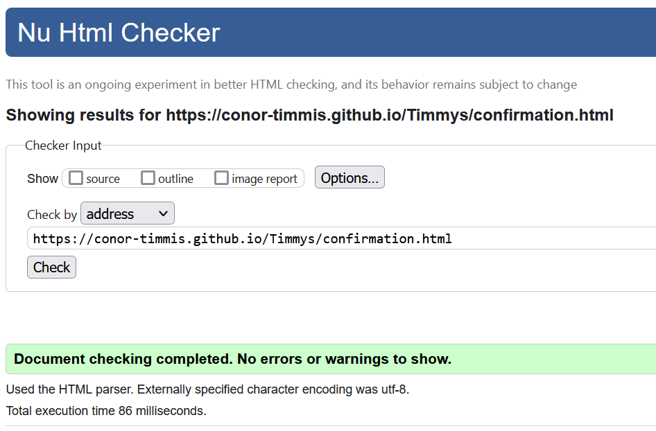
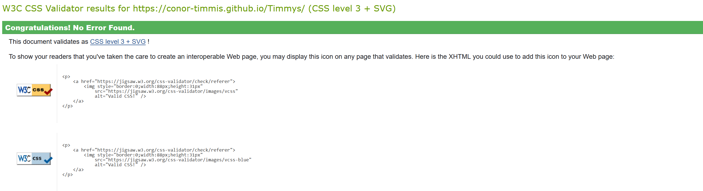
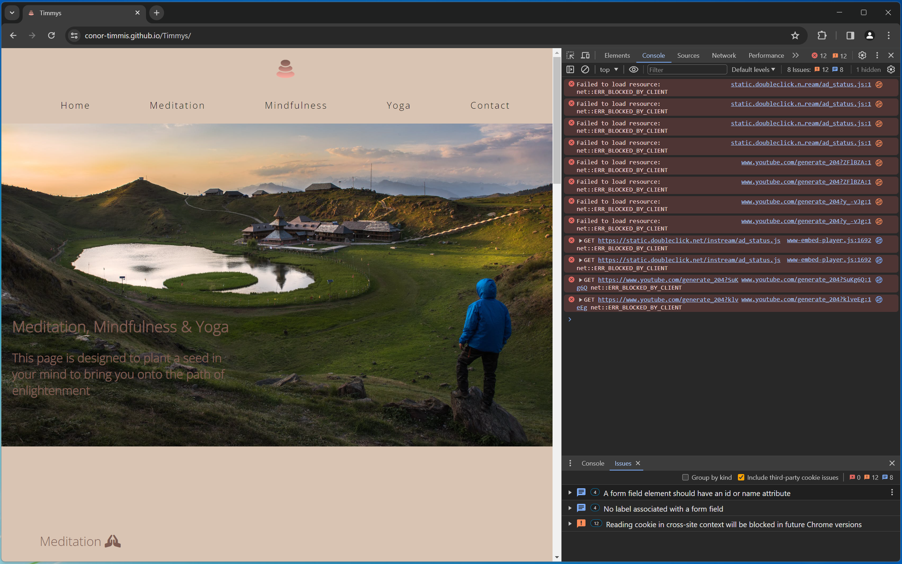
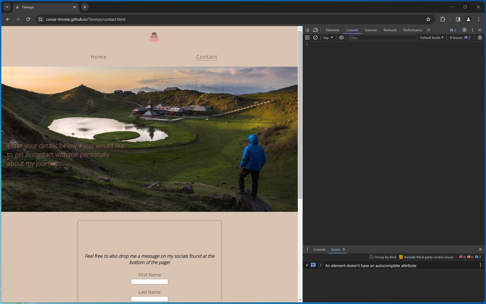
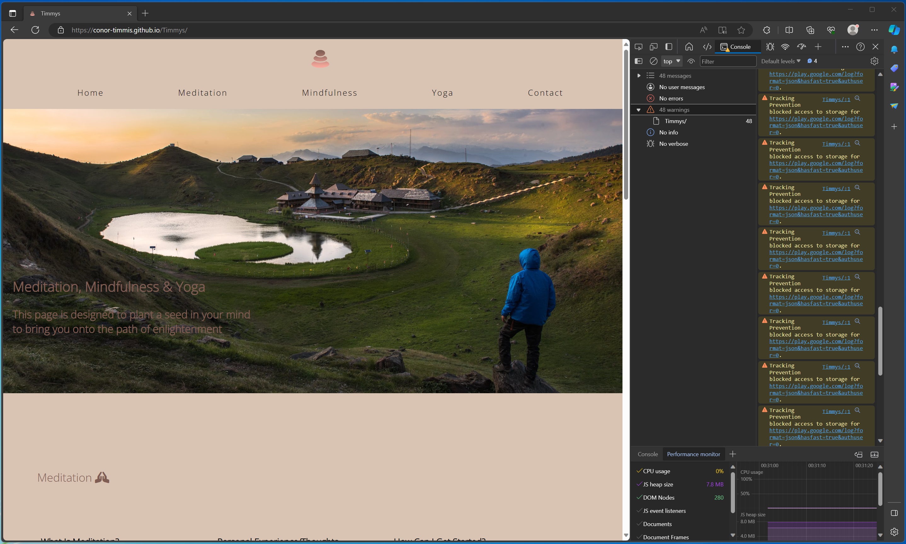
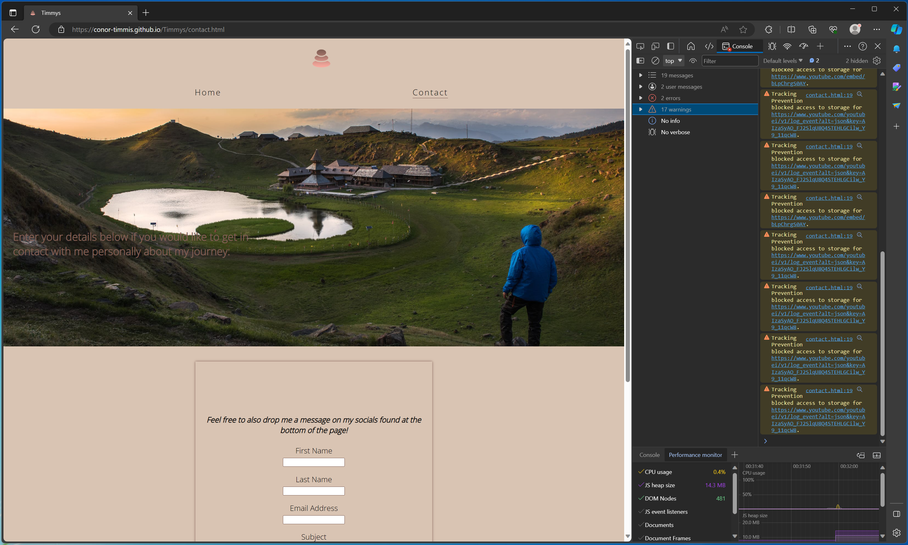
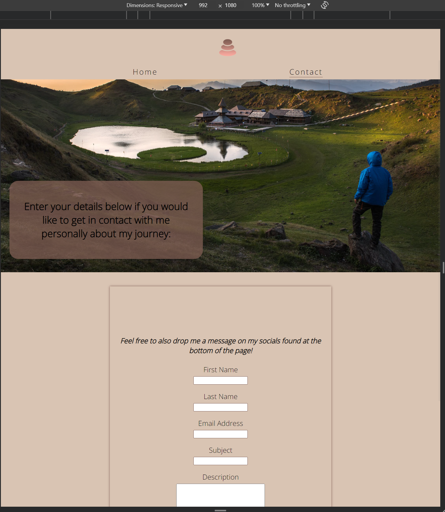

# Testing

Return back to the [README.md](README.md) file.

## Code Validation

Below I have linked all the necessary screenshots to validate my code:
- [Home Page Validation](documentation/testing/indexcheck.png) with the HTML W3C Validator
- [Contact Page Validation](documentation/testing/contactcheck.png) with the HTML W3C Validator
- [Confirmation Page Validation](documentation/testing/confirmationcheck.png) with the HTML W3C Validator
- [Style Sheet Validation](documentation/testing/csscheck.png) with the Jigsaw W3C Validator

### HTML

I have used the recommended [HTML W3C Validator](https://validator.w3.org) to validate all of my HTML files.

- Home [W3C](https://validator.w3.org/nu/?doc=https%3A%2F%2Fconor-timmis.github.io%2FTimmys%2Findex.html) |  | No errors or warnings to show. |
- Contact [W3C](https://validator.w3.org/nu/?doc=https%3A%2F%2Fconor-timmis.github.io%2FTimmys%2Fcontact.html) |  | No errors or warnings to show. |
- Contact [W3C](https://validator.w3.org/nu/?doc=https%3A%2F%2Fconor-timmis.github.io%2FTimmys%2Fconfirmation.html) |  | No errors or warnings to show. |

### CSS

I have used the recommended [CSS Jigsaw Validator](https://jigsaw.w3.org/css-validator) to validate all of my CSS files.

- Style Sheet [Jigsaw Page](http://jigsaw.w3.org/css-validator/validator?lang=en&profile=css3svg&uri=https%3A%2F%2Fconor-timmis.github.io%2FTimmys%2F&usermedium=all&vextwarning=&warning=1) |  | No errors found. |

## Browser Compatibility

I've tested my deployed project on multiple browsers to check for compatibility issues.

- Firefox  |  | Works as expected |
- Chrome |  |  | Shows minor errors (no autocomplete attribute on contact form) and JS errors from iFrames |
- Edge |  |  | Works as expected, though shows tracking errors from Google (iFrames) |

## Responsiveness

I've tested my deployed project on multiple devices to check for responsiveness issues.

- Mobile (DevTools) | [Home](documentation/responsiveness/responsive/mobilehome.png) | [Contact](documentation/responsiveness/responsive/mobilecontact.png) Works as expected                             - Tablet (DevTools) | [Home](documentation/responsiveness/responsive/tablethome.png) | [Contact](documentation/responsiveness/responsive/tabletcontact.png) Works as expected
- Desktop | [Home](documentation/responsiveness/desktophome.png) |  Works as expected
- XL Monitor | [Home](documentation/responsiveness/xlhome.png) | [Contact](documentation/responsiveness/xlcontact.png) Works as intended
- 4K Monitor | [Home](documentation/responsiveness/4khome) | [Contact](documentation/responsiveness/4kcontact) Noticeable scaling issues
